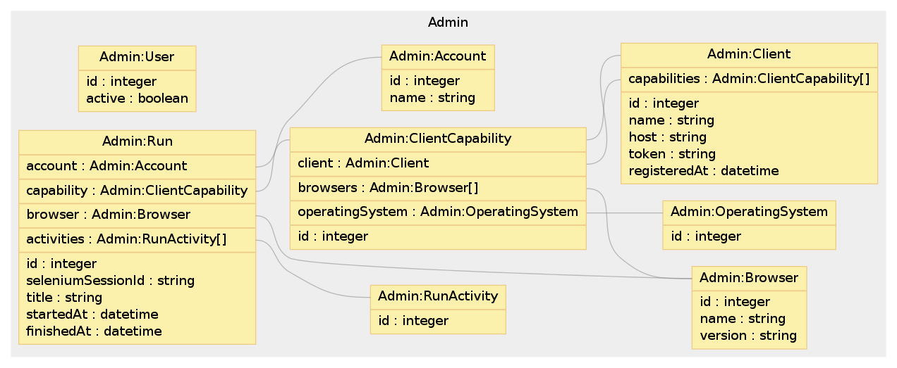

# DoctrineExtraBundle

 [](https://packagist.org/packages/alexandresalome/doctrine-extra-bundle) [](https://packagist.org/packages/alexandresalome/doctrine-extra-bundle) [](https://packagist.org/packages/alexandresalome/doctrine-extra-bundle) [](https://packagist.org/packages/alexandresalome/doctrine-extra-bundle) [](https://packagist.org/packages/alexandresalome/doctrine-extra-bundle)

Graph tool for Doctrine. Relies on [Graphviz](http://www.graphviz.org/).

* [View CHANGELOG](CHANGELOG.md)
* [View CONTRIBUTORS](CONTRIBUTORS.md)



## Installation

Install the latest version with

```bash
composer require --dev alexandresalome/doctrine-extra-bundle
```

Then, enable the bundle by adding the following line in the ``app/AppKernel.php``
file of your project:

```php
// app/AppKernel.php

class AppKernel extends Kernel
{
    public function registerBundles()
    {
        //...
        if (in_array($this->getEnvironment(), ['dev', 'test'])) {
            // ...
            // Because the vendor code could be not present, you should check if the bundle is here before using it.
            $bundles[] = new Alex\DoctrineExtraBundle\AlexDoctrineExtraBundle();
        }


        // ...
    }

    // ...
}
```

## Usage

### Dump entity manager schema as graph

```bash
php app/console doctrine:mapping:graphviz
```

If you want to create a PDF file out of it, with Linux:

.. code-block:: bash

```
php app/console doctrine:mapping:graphviz | dot -Tpdf -oout.pdf
xdg-open out.pdf
```

## Development

### Generate sample graphs

A set of sample entities are available to test internally the schema generations. You can generate the graph for any of the samples (located in Tests/Fixtures) by running:

```bash
./Resources/bin/graph Simple | dot -Tpdf -oout.pdf
xdg-open out.pdf
```
